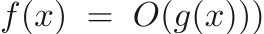
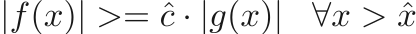
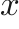
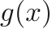
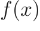
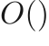

# Algorithms and Data Structures
This is a repository I made to recreate a bunch of data structures and algorithms in 
bunch of different languages. If you want to reuse this code or build process, go ahead!

I will try to work through some of the basic implementations and theory behind these algorithms in
as much detail as I can here. I used readme2tex to generate the equations and generated a git hook to
update the README whenever the PRECOMPILEDREADME is updated.

## Formal definition of Big O Function

if there exists a constant  and  such that 

The best way to interpret this is to think of  as very large value of x. So for all values of 
greater than , the value of the big O version of the function  is going to approach 
for values of  that are very large. What this means practically, is that the largest order terms (what is
left after the  operation) will dominate the function asymtotically.

