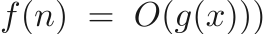
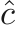
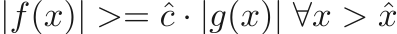

# Algorithms and Data Structures
This is a repository I made to recreate a bunch of data structures and algorithms in 
bunch of different languages. If you want to reuse this code or build process, go ahead!

I will try to work through some of the basic implementations and theory behind these algorithms in
as much detail as I can here. I used readme2tex to generate the equations and generated a git hook to
update the README whenever the PRECOMPILEDREADME is updated.

## Formal definition of Big O Function

if there exists a constant  and  such that 

